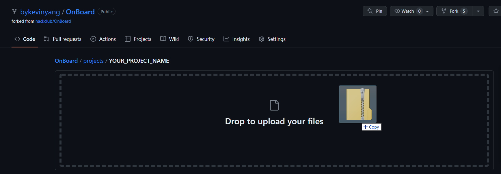

# Directions
Interested in submitting to OnBoard? You're in the right place!

## 1. Fork!
Fork the [`onboard`](https://github.com/hackclub/OnBoard/) repo! This is the where you'll add your project files and eventually PR from!

## 2. Design a Board!
It's design time! Head over to an eCAD software of your choice (EasyEDA, KiCAD, Eagle) and start designing!

Never designed before? No problem! We have design resources for EasyEDA, a free online eCAD program. Check them out here.

## 3. Upload to JLCPCB and Check
Upload your Gerber files to JLCPCB and make sure they pass inspection. This is done by going to check out and selecting the review before paying option.

This is **VITAL** since your project will only be approved if it passes inspection. **Take a screen shot**. You'll include this in your PR later.

## 4. Add Your Design to Your Project Repo
From your fork of `OnBoard`, create a folder with your project name under `OnBoard/projects`. To do this, go to the projects folder and click `Create new file`.

Then in the box labeled `name your file...`, type in `PROJECT_NAME/README.md`. This creates a README file under a folder called named after your project.

After this, copy and paste the contents of [`TEMPLATE.md`](./projects/!Template/TEMPLATE.md) into the text editor and fill it out!

Once your done, press the big green `Commit changes` button to save!

With your README filled out, head over to add files to begin uploading your Gerber, design files, and screen shot of JLCPCB approval. 

In all, you should have the following files under your project folder:
- [ ] `Gerbers.zip`: This should be the file that you send off to JLCPCB.
- [ ] `JLCPCB.png`: A screen shot of JLCPCB approving your board
- [ ] Design files (`design.json`, `design.sch`, `design.brd`, etc). Whatever format your designer outputs to should be included.
- [ ] `README.md`: A filled out [`TEMPLATE.md`](./TEMPLATE.md), renamed to `README.md`

If you have all the above, you're done with this step!

## 6. Create a PR!
Once you've uploaded your files, you can merge them to the main repo through a pull request! Under the contribute tab of your forked repo, click the big green `Open pull request`.

That will bring you to the main repo, where you'll initiate a pull request. Follow the checklist, we'll then review your PR and you'll be off to the races!

> Here's a quick preview of the [submission checklist](.github/PULL_REQUEST_TEMPLATE.md)
> ## Submission Checklist:
> - [ ] I am a current high school, middle school, or home schooled student.
>- [ ] I am a member of the Hack Club Slack (Join [here](https://hackclub.com/slack>)).
> - [ ] I have followed [DIRECTIONS.md](https://github.com/hackclub/OnBoard/directions.md)
>   - [ ] Created a folder under `onboard/projects`
>   - [ ] Filled out `TEMPLATE.md`
>   - [ ] Uploaded Gerber and design files
>  - [ ] Uploaded screen shot of PCB passing JLCPCB inspection

## 7. Ship it!
Post photos of your board in `#onboard`! We can't wait to see what you make!

